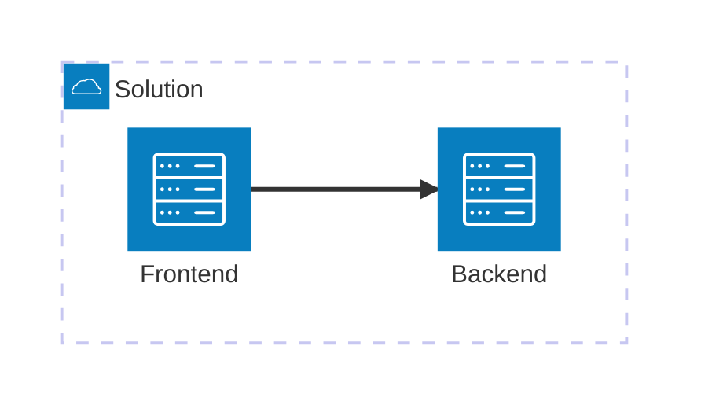

# AI Application chassis - best AI app practices optimized for Azure

ToC: [**USER STORY**](#user-story) \| [**GETTING STARTED**](#getting-started)  \| [**HOW IT WORKS**](#how-it-works)

## User story

### Azure AI App Kickstarter overview

L100 level aplication stub for an AI copilot/agent.

## Getting Started

### Codespaces and DevContainers

This respository has been configured to support GitHub Codespace and DevContainers.

[](https://codespaces.new/evmin/az-ai-kickstarter) [](https://vscode.dev/redirect?url=vscode://ms-vscode-remote.remote-containers/cloneInVolume?url=https://github.com/evmin/az-ai-kickstarter)

> [!WARNING]
> Do NOT `git clone` the application under Windows and then open a DevContainer. 
> This would create issues with file end of lines. For DevContainer click on the button 
> above and let Visual Studio Code download the repository for you. Alternatively you 
> can also `git clone` under Windows Subsystem for Linux (WSL) and ask Visual Studio Code to
> `Re-Open in Container`.

### Local

It is possible to work with a fully local setup.

  - [Azure CLI](https://learn.microsoft.com/en-us/cli/azure/what-is-azure-cli): `az`
  - [Azure Developer CLI](https://learn.microsoft.com/en-us/azure/developer/azure-developer-cli/overview): `azd`
  - [Python](https://www.python.org/about/gettingstarted/): `python`
  - [UV](https://docs.astral.sh/uv/getting-started/installation/): `uv`
  - Optionally [Docker](https://www.docker.com/get-started/): `docker` 

> [!TIP] 
> **Az AI Tip**: Document here how to quickly deploy the solution. Try to reduce this to `azd up` by
> automating as much as possible. Have a look at `main.bicep` and `scripts` for examples of how to do
> that

### Quick deploy


#### Deployment pre-requisites

Codespaces and DevContainer come with all deployment and development pre-requisites already installed.

On Windows you can install the pre-requisites by executing the following commands in a PowerShell terminal:
```powershell
	winget install Python.Python.3.12
	winget install Microsoft.PowerShell
	winget install Microsoft.AzureCLI
	winget install Microsoft.Azd
	winget install Microsoft.Git
```

Ubuntu/WSL: TBD

MacOSX: TBD

#### Deploy with authentication disabled

To deploy Azure AI App Kickstarter just run: 
```bash
azd up
``` 

#### Deploy with authentication enabled

AZD can automatically configures authentication to secure frontend and/or backend. To do so execute the following command before `azd up`:
```bash
azd env set WITH_AUTHENTICATION true
```

If you already executed `azd up` just set the variable and run provisioning again:
```bash
azd env set WITH_AUTHENTICATION true
azd provision
```

> [!WARNING] The account executing `azd` needs to be able to create Application Registrations in your Azure
> Entra ID tenant.

## How it works

- TODO: How to run backend locally
- TODO: How to run frontend locally

### User Manual

- TODO : Observability

> [!TIP] 
> **Az AI Tip**: Document how the solution is used and operated here.
> Optionally, if the section is too long, create a `USER_MANUAL.md` file and
> link to it from here.

### External Model

If you have an external Azure OpenAI model already provisioned, you can reference it by setting environment variable prior callin `azd up`

```sh
export AOAI_ENDPOINT="https://<endpoint>.openai.azure.com"
export AOAI_DEPLOYMENT_NAME="gpt-4o-2024-11-20"
export AOAI_API_VERSION="2024-12-01-preview"
export aoaikeysecret="key"
```

>[WARNING!] The `aoaikeysecret` is not set in azd .azure/<env>./.env file automatically.
> In order to use it when running the model locally, either set it as env variable or add it to azd `.env` file.

### Architecture



## Code of Conduct

This project has adopted the [Microsoft Open Source Code of Conduct](https://opensource.microsoft.com/codeofconduct/).

Resources:

- [Microsoft Open Source Code of Conduct](https://opensource.microsoft.com/codeofconduct/)
- [Microsoft Code of Conduct FAQ](https://opensource.microsoft.com/codeofconduct/faq/)
- Contact [opencode@microsoft.com](mailto:opencode@microsoft.com) with questions or concerns

For more information see the [Code of Conduct FAQ](https://opensource.microsoft.com/codeofconduct/faq/) or
contact [opencode@microsoft.com](mailto:opencode@microsoft.com) with any additional questions or comments.

## Responsible AI Guidelines

This project follows the below responsible AI guidelines and best practices, please review them before using this project:

- [Microsoft Responsible AI Guidelines](https://www.microsoft.com/en-us/ai/responsible-ai)
- [Responsible AI practices for Azure OpenAI models](https://learn.microsoft.com/en-us/legal/cognitive-services/openai/overview)
- [Safety evaluations transparency notes](https://learn.microsoft.com/en-us/azure/ai-studio/concepts/safety-evaluations-transparency-note)

## Acknowledgements

  * Kudos to [Pamela Fox](https://github.com/pamelafox) and [James Casey](https://github.com/jamesc) for [Azure-Samples/openai-chat-app-entra-auth-builtin](https://github.com/Azure-Samples/openai-chat-app-entra-auth-builtin) from which we borrowed most of authentication & authorization setup.
  * Special thank you to [Michael Hofer](https://github.com/mhofer1976) for extensive testing and solving o1 compatibility

## Authors

  * [Dominique Broeglin](https://github.com/dbroeglin)
  * [Evgeny Minkevich](https://github.com/evmin)
