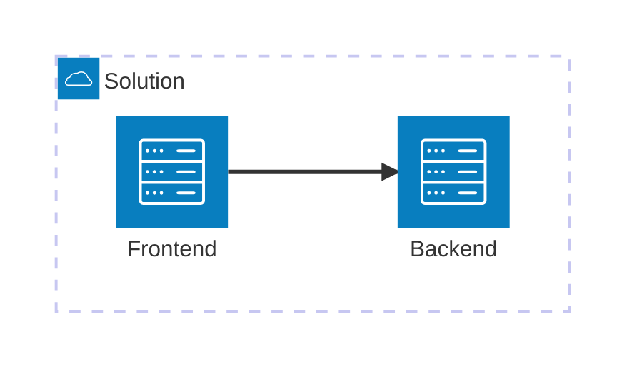

# AI Application chassis - best AI app practices optimized for Azure

ToC: [**USER STORY**](#user-story) \| [**GETTING STARTED**](#getting-started)  \| [**HOW IT WORKS**](#how-it-works)

 

## User story

### Hello AI World overview

> [!TIP] 
> **AI GBB Tip**: Document what your solution does here.

## Getting Started

### Prerequisites

Ideally, open this repository in a Codespace on GitHub or in a DevContainer.

Alternatively you will need: 
  - [Azure CLI](https://learn.microsoft.com/en-us/cli/azure/what-is-azure-cli): `az`
  - [Azure Developer CLI](https://learn.microsoft.com/en-us/azure/developer/azure-developer-cli/overview): `azd`
  - [Docker](https://www.docker.com/get-started/): `docker`
  - [Python](https://www.python.org/about/gettingstarted/): `python`
  - [UV](https://docs.astral.sh/uv/getting-started/installation/): `uv`

> [!TIP] 
> **AI GBB Tip**: Document here how to quickly deploy the solution. Try to reduce this to `azd up` by
> automating as much as possible. Have a look at `main.bicep` and `scripts` for examples of how to do
> that

### Quick deploy

To deploy Hello AI World just run: 
`azd up`

## How it works

### User Manual

> [!TIP] 
> **AI GBB Tip**: Document how the solution is used and operated here.
> Optionally, if the section is too long, create a `USER_MANUAL.md` file and
> link to it from here.

### Architecture

> [!TIP] 
> **AI GBB Tip**: Document the solution's architecture here.
> Optionally, if the section is too long, create a `ARCHITECTURE.md` file and
> link to it from here.

> [!TIP] 
> **AI GBB Tip**: For architecture diagrams, you can leverage the [Markdown text
> diagramming capabilities](https://docs.github.com/en/get-started/writing-on-github/working-with-advanced-formatting/creating-diagrams) available in GitHub. See example below.

## Code of Conduct

This project has adopted the [Microsoft Open Source Code of Conduct](https://opensource.microsoft.com/codeofconduct/).

Resources:

- [Microsoft Open Source Code of Conduct](https://opensource.microsoft.com/codeofconduct/)
- [Microsoft Code of Conduct FAQ](https://opensource.microsoft.com/codeofconduct/faq/)
- Contact [opencode@microsoft.com](mailto:opencode@microsoft.com) with questions or concerns

For more information see the [Code of Conduct FAQ](https://opensource.microsoft.com/codeofconduct/faq/) or
contact [opencode@microsoft.com](mailto:opencode@microsoft.com) with any additional questions or comments.

## Responsible AI Guidelines

This project follows below responsible AI guidelines and best practices, please review them before using this project:

- [Microsoft Responsible AI Guidelines](https://www.microsoft.com/en-us/ai/responsible-ai)
- [Responsible AI practices for Azure OpenAI models](https://learn.microsoft.com/en-us/legal/cognitive-services/openai/overview)
- [Safety evaluations transparency notes](https://learn.microsoft.com/en-us/azure/ai-studio/concepts/safety-evaluations-transparency-note)
